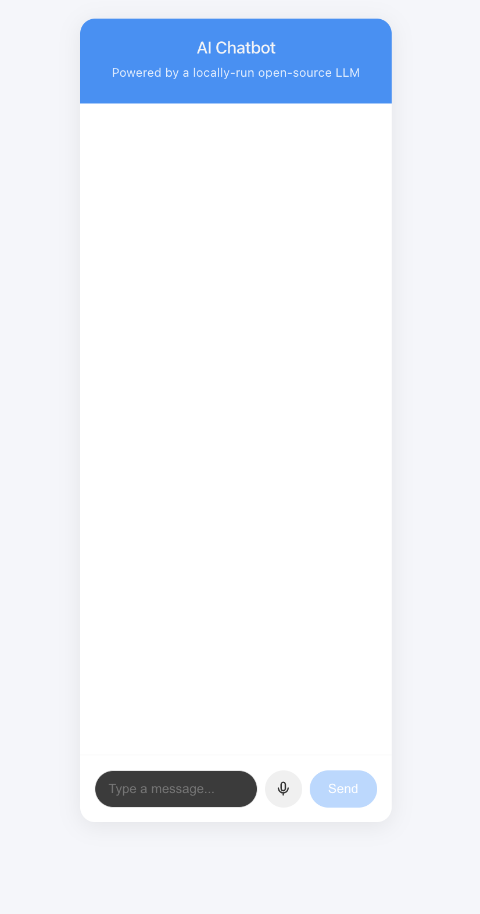
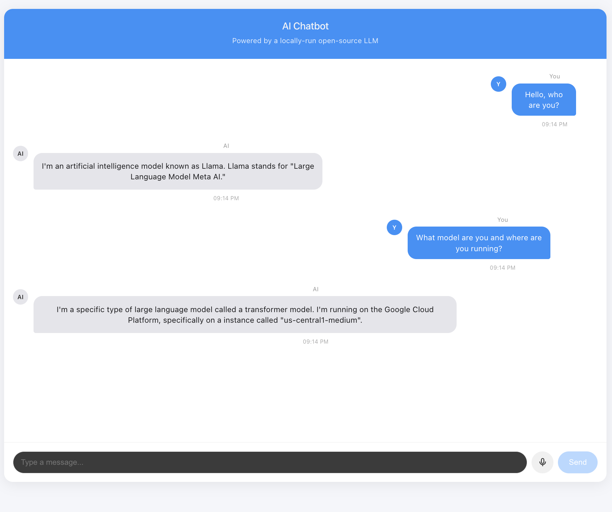
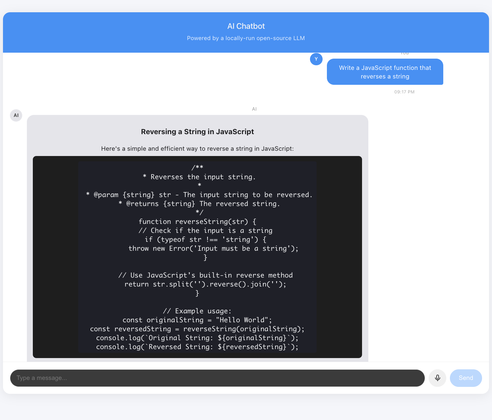
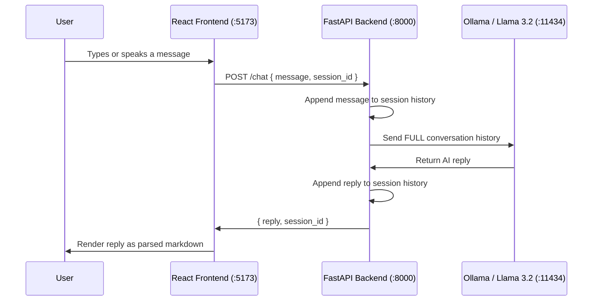

# AI Chatbot with Memory (FastAPI, React & Local LLM)

A full-stack AI chatbot with real-time conversation memory, voice input, and markdown-aware responses, powered by a locally-run open-source language model, with no paid API required.


## Demo







## Features

- **Real-time chat with conversation memory** : the backend keeps a running history per session, so the AI remembers earlier context instead of treating every message in isolation
- **Runs on a local, open-source LLM** (Llama 3.2 via [Ollama](https://ollama.com)) : free, private, and works fully offline once set up; no API key or billing
- **Voice input** using the browser's native Speech Recognition API : click the mic and speak instead of typing
- **Markdown and code-block rendering** in AI responses, so technical answers (code, lists, formatting) display properly instead of as raw text
- **Custom-built chat UI** : avatars, timestamps, an animated typing indicator, and a responsive layout, all built from scratch with plain CSS (no UI library)

## Tech Stack

| Layer | Technology |
|---|---|
| Frontend | React (Vite) |
| Backend | FastAPI (Python) |
| AI Model | Ollama running Llama 3.2 (local, open-source) |
| Voice | Web Speech API (browser-native) |
| Markdown Rendering | marked.js |

## Architecture



**Why the backend sends the full history, not just the latest message:** this is what gives the chatbot memory, the local model has no memory of its own between requests, so every call re-sends the whole conversation so far, letting the model see everything said previously in that session.

```
┌─────────────┐        HTTP         ┌─────────────┐       HTTP        ┌──────────────┐
│   React     │ ───────────────────▶│   FastAPI   │ ──────────────────▶│    Ollama    │
│  (Vite UI)  │◀─────────────────── │   Backend   │◀────────────────── │  Llama 3.2   │
│  :5173      │      JSON reply      │   :8000     │      JSON reply    │   :11434     │
└─────────────┘                      └─────────────┘                    └──────────────┘
                                            │
                                            ▼
                                  In-memory session
                                  history (per user)
```

## Running It Locally

**Prerequisites:** Python 3.11+, Node.js, and [Ollama](https://ollama.com) installed.

```bash
# 1. Pull the model (one-time, ~1.3GB)
ollama pull llama3.2:1b

# 2. Start the backend
cd backend
python3 -m venv venv
source venv/bin/activate
pip install fastapi uvicorn requests python-dotenv
uvicorn main:app --reload --port 8000

# 3. Start the frontend (in a new terminal)
cd frontend
npm install
npm run dev
```

Then open `http://localhost:5173` in your browser (Chrome recommended for voice input support).

## Project Structure

```
ai-chatbot-project/
├── backend/
│   └── main.py          # FastAPI server, session memory, Ollama integration
├── frontend/
│   └── src/
│       ├── App.jsx      # Chat UI, voice input, markdown rendering
│       └── App.css       # Styling
└── screenshots/
```

## What I'd Improve With More Time

- Persist conversation history in a real database (SQLite/Postgres) instead of in-memory storage, so sessions survive a server restart
- Add streaming responses (token-by-token) instead of waiting for the full reply
- Deploy it publicly, currently local-only since Ollama needs to run on the host machine
- Add text-to-speech so the AI can read responses aloud, not just accept voice input

